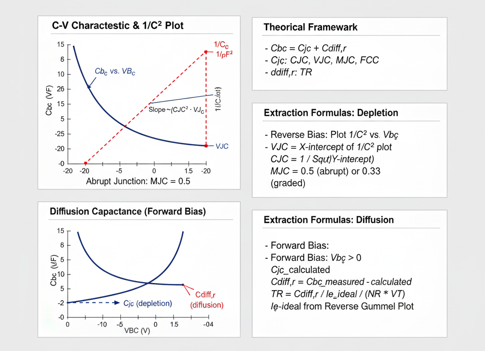

## Theory
**Introduction:**  
BJT B-C Junction C-V Parameter Extraction

      
      
<strong>Fig. 1. BJT Base-Collector C-V Characteristics & Parameter Extraction</strong>

The base-collector (B-C) junction capacitance ($C_{bc}$) is a critical parameter in the BJT SPICE model. It models the charge stored at the collector-base junction and is a key factor in determining the high-frequency performance of the transistor (e.g., the Miller effect) and its switching speed (e.g., storage time in saturation).

This capacitance is measured by applying a varying voltage across the B-C junction and measuring the capacitance, typically while the B-E junction is held at zero bias or is reverse-biased.

Like any p-n junction, the total B-C capacitance ($C_{bc}$) has two components:

1.  **B-C Depletion Capacitance ($C_{jc}$):** Dominant when the B-C junction is reverse-biased (i.e., in the forward-active region).
2.  **B-C Diffusion Capacitance ($C_{diff,r}$):** Dominant when the B-C junction is forward-biased (i.e., in the saturation region).

$$C_{bc} = C_{jc} + C_{diff,r}$$

---

## 1. Depletion Capacitance ($C_{jc}$)

This capacitance arises from the fixed, uncovered charge in the depletion region (or space-charge region) at the B-C junction.

### Key SPICE Parameters

* **`CJC` (B-C Zero-Bias Capacitance):** The value of the depletion capacitance when the applied B-C voltage is zero. (Also known as `CBC`).
* **`VJC` (B-C Built-in Potential):** The built-in potential of the B-C junction (e.g., ~0.5-0.7V). (Also known as `PBC`).
* **`MJC` (B-C Grading Coefficient):** Describes the doping profile of the junction (e.g., 0.5 for abrupt, 0.33 for graded). (Also known as `MC`).
* **`FCC` (Forward-Bias Capacitance Coefficient):** A fitting parameter (default 0.5) to linearize the capacitance in the forward-bias region.

### The Model Equation

The depletion capacitance under reverse bias ($V_{BC} < FCC \cdot VJC$) is modeled by the same equation as a diode:

$$C_{jc} = \frac{CJC}{(1 - V_{BC} / VJC)^{MJC}}$$

*(Note: For reverse bias, $V_{BC}$ is negative, so the denominator increases and capacitance decreases.)*

### Extraction Method: The $1/C^2$ Plot

The parameters `CJC`, `VJC`, and `MJC` are extracted from C-V measurements taken while the B-C junction is **reverse-biased**.

The extraction method linearizes the model equation. For an **abrupt junction (MJC = 0.5)**, which is a common approximation for the B-C junction, we plot $1/C_{jc}^2$ vs. $V_{BC}$:

$$\frac{1}{C_{jc}^2} = \frac{1 - V_{BC} / VJC}{CJC^2} = \left( \frac{1}{CJC^2} \right) - \left( \frac{1}{CJC^2 \cdot VJC} \right) \cdot V_{BC}$$

This equation is in the linear form $y = b + m \cdot x$:

* **$y = 1/C_{jc}^2$**
* **$x = V_{BC}$** (the applied voltage)
* **$b = 1/CJC^2$** (the y-intercept)
* **$m = -1 / (CJC^2 \cdot VJC)$** (the slope)

**Extraction Procedure:**

1.  **Measure C-V:** Measure the B-C capacitance $C_{bc}$ at several reverse bias voltages $V_{BC}$ (e.g., from 0V to -20V), while $V_{BE} = 0$. In this condition, $C_{bc} \approx C_{jc}$.
2.  **Plot Data:** Create a plot of $1/C_{bc}^2$ (y-axis) versus $V_{BC}$ (x-axis). The data should form a straight line.
3.  **Extract `VJC`:** Extend the straight line to the x-axis (where $y=0$). The x-intercept is the junction potential, **`VJC`**.
4.  **Extract `CJC`:** The y-intercept (at $V_{BC} = 0$) is $1/CJC^2$. Therefore, **`CJC`** is calculated as:
    $$CJC = \frac{1}{\sqrt{\text{y-intercept}}}$$
5.  **Verify `MJC`:** If the plot is a straight line, the assumption that `MJC = 0.5` is correct. If it is curved, a different `MJC` value (e.g., 0.33 for a graded junction, requiring a $1/C_{bc}^3$ plot) may be needed.

---

## 2. Diffusion Capacitance ($C_{diff,r}$)

This capacitance arises from the charge of minority carriers injected into the base and collector when the **B-C junction is forward-biased** (i.e., when the transistor is in saturation).

### Key SPICE Parameter

* **`TR` (Reverse Transit Time):** Represents the mean time for carriers injected from the collector to transit through the base (in reverse-active mode).

### The Model Equation

The reverse diffusion capacitance is proportional to the reverse transit time and the change in the reverse injection current:

$$C_{diff,r} = TR \cdot \frac{dI_{E,ideal}}{dV_{BC}} \approx TR \cdot \frac{I_{E,ideal}}{NR \cdot V_T}$$

Where $I_{E,ideal}$ is the ideal emitter current from the reverse Gummel plot.

### Extraction Method

The reverse transit time `TR` is extracted from measurements taken while the B-C junction is **forward-biased** (i.e., in the saturation or reverse-active region).

**Extraction Procedure:**

1.  **Measure $C_{bc}$ in Forward Bias:** Measure the total capacitance $C_{bc}$ at one or more forward-bias $V_{BC}$ values (e.g., 0.2V, 0.3V, 0.4V).
2.  **Calculate $C_{jc}$:** At these forward-bias points, the depletion capacitance $C_{jc}$ is still present. Calculate its value using the forward-bias portion of its model (which uses the `FCC` parameter).
3.  **Isolate $C_{diff,r}$:** Subtract the calculated depletion capacitance from the total measured capacitance:
    $$C_{diff,r} = C_{bc, \text{measured}} - C_{jc, \text{calculated}}$$
4.  **Extract `TR`:** Re-arrange the model equation to solve for `TR`. You will need the values of the ideal emitter current ($I_{E,ideal}$) from the **reverse Gummel plot** at the same $V_{BC}$ points.
    $$TR = \frac{C_{diff,r}}{(I_{E,ideal} / (NR \cdot V_T))}$$

Alternatively, `TR` can be extracted from high-frequency S-parameter measurements or by measuring the storage time ($t_s$) of the transistor when turning off from saturation.

     
 
